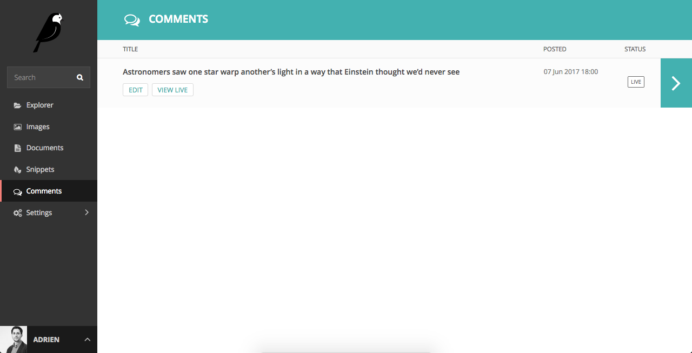
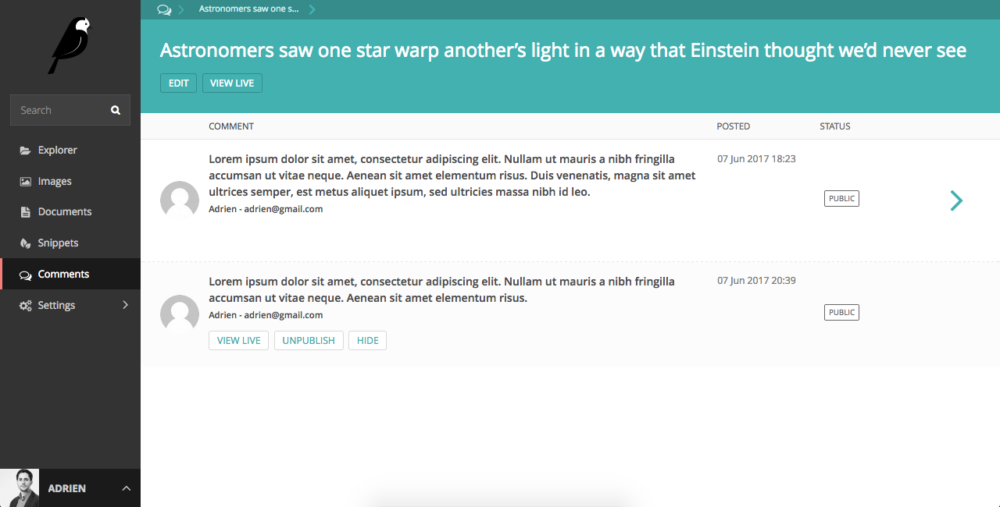

# Wagtail Comments

This module allows you to manage [django-comments-xtd](https://github.com/danirus/django-comments-xtd) comments into the Wagtail admin UI. Tested on Wagtail 1.7+.

## Instructions

`pip install wagtailcomments_xtd`
Add `'wagtailcomments_xtd'` to your INSTALLED_APPS
Add `'wagtailfontawesome'` to INSTALLED_APPS if it's not there already

